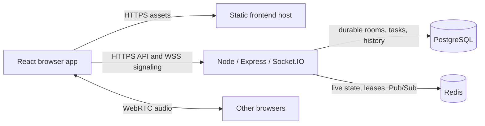

# Constellate

A collaborative study room built with React, TypeScript, Express, Socket.IO, PostgreSQL and Redis. It includes guest presence, a shared Pomodoro timer, chat, reactions, persistent tasks, study statistics and optional audio-only WebRTC. Production Hardening V1 preserves the existing UI and features.

## Architecture



| Directory | Responsibility |
| --- | --- |
| `client/` | React UI, one socket per tab, room recovery and WebRTC peers |
| `server/` | Statistics/health HTTP, validation, Socket.IO signaling, persistence and accounting |
| `shared/` | TypeScript event/data contracts; no runtime secrets |
| `server/db/migrations/` | Ordered SQL migrations with checksums, transactions and an advisory lock |
| `vercel.json` | The single Vercel frontend build, SPA deep-link routing and response headers |
| `render.yaml` | Backend service, private PostgreSQL/Redis, release migrations and readiness |

PostgreSQL owns durable rooms, tasks and study history. Redis owns presence, timers, capped chat/reactions, voice membership, statistics access tokens and pending accounting; its Socket.IO adapter broadcasts between backend instances. Audio goes directly between browsers. There is no camera, recording, media upload or SFU.

Guest identities live in localStorage and are anonymous, not authenticated accounts. Same-origin tabs share one logical guest. CORS and room links are not authentication: anyone who knows a room ID can join. Use independent browser profiles for separate guests.

## Local setup

Use Node **24.16.0** (also in `.node-version`) and npm. From the repository root in Windows PowerShell:

```powershell
npm.cmd ci
npm.cmd run db:setup
npm.cmd run redis:setup
npm.cmd run db:start
npm.cmd run redis:start
npm.cmd run db:migrate
npm.cmd run dev
```

Open **http://localhost:5173/r/demo**. The helpers create ignored credentials/data under `server/.env` and `server/.local/`. Do not overwrite an existing `.env`. The Redis helper uses a pinned, checksum-verified portable Windows build without changing services, PATH or firewall settings.

On later starts, run `db:start`, `redis:start`, `db:migrate`, then `dev`. Root `npm run dev` checks ports, configuration and dependencies before starting both processes; Vite waits for backend readiness. Stop the app with Ctrl+C, then optionally `npm run redis:stop` and `npm run db:stop`. Use `npm` instead of `npm.cmd` outside PowerShell.

On macOS/Linux, run PostgreSQL and Redis using your package manager or containers. Copy `server/.env.example` only if no `.env` exists; set `DATABASE_URL`, a **separate** `TEST_DATABASE_URL`, and `REDIS_URL`. Then run `npm ci`, `npm run db:migrate`, and `npm run dev`. No client `.env` is required locally.

Development ports: Vite **5173**, Node **3000**, PostgreSQL **5432**, Redis **6379**. Vite proxies `/api` and `/socket.io`, including WebSocket upgrades. Separate terminals remain supported through `dev:server` and `dev:client`. See [local troubleshooting](docs/local-development.md).

## Configuration

| Variable | Where / purpose |
| --- | --- |
| `NODE_ENV` | Server: `production` enables strict origin validation and JSON logging; ignores local `.env` |
| `PORT`, `HOST` | Server listen address; defaults `3000`, `0.0.0.0`; deployment uses the host-assigned port |
| `DATABASE_URL` | Required server-only PostgreSQL URL |
| `REDIS_URL` | Required server-only `redis://` private-network or `rediss://` TLS URL |
| `REDIS_KEY_PREFIX` | Shared namespace for nodes serving one database; isolate staging/tests |
| `CLIENT_ORIGINS` | Exact comma-separated origins, no slash/paths/wildcards; required HTTPS origins in production |
| `TRUST_PROXY_HOPS` | Trusted proxy count: `0` locally, `1` in the Render configuration |
| `LOG_LEVEL` | `debug`, `info` (default), `warn`, `error` |
| `HEALTH_TIMEOUT_MS` | Readiness deadline; default `2000` |
| `SHUTDOWN_TIMEOUT_MS` | Drain deadline; default `25000`, shorter than the host's termination grace |
| `VITE_SERVER_URL` | Public build-time HTTPS backend origin for **both** HTTP statistics and Socket.IO; blank locally or behind a same-origin production proxy |
| `VITE_ICE_SERVERS` | Public JSON ICE array; blank uses Google STUN, `[]` enables host-only local tests |
| `SERVER_PROXY_TARGET` | Development-only override; normally blank so Vite follows backend `PORT` |
| `TEST_DATABASE_URL` | Local/CI tests only; never production |

Rebuild the frontend after changing `VITE_*` values. They are visible to anyone downloading the app. Never put private credentials in them. Production builds do not read backend `.env` configuration or include Vite's development proxy.

## Production deployment

See the [production runbook](docs/production-v1.md) for the Vercel frontend + Render backend deployment, environment setup, HTTPS/WSS, migrations, monitoring, rollback and acceptance checks. **Deployment files are prepared; hosted resources have not been provisioned in this session.**

```sh
npm ci --include=dev
npm run build
# After injecting production server environment variables:
npm run db:migrate:production
npm start
```

Production runs compiled Node code. Socket.IO starts with HTTP polling and upgrades to WebSocket when available, so rooms still work on networks that block WebSockets. Polling requires requests for one session to reach the same backend instance; the Render Blueprint runs one instance. Configure session affinity before scaling to multiple backend instances. Each reconnect rejoins the room and reloads authoritative snapshots. Frontend hosting must support SPA fallback for `/r/*`, `/room/*` and `/join`.

- `GET /api/health`: Render health check, reporting `server`, `database` and `redis` without credentials; HTTP 503 on dependency failure or draining.
- `GET /api/ready`: compatible alias of `/api/health`.
- Startup refuses missing/changed migrations or unavailable dependencies. Health responses are not cached.
- SIGTERM/SIGINT stops new work, closes transports so clients retry, drains accepted work/accounting, then closes Redis/PostgreSQL. A deadline bounds shutdown.
- Production logs are JSON with timestamps, levels and event names. HTTP logs use generated request IDs and route patterns. Credentials, bodies, authorization headers, query strings and WebRTC payloads are excluded.

## Recovery and voice

Guest desks survive short disconnects with a 15-second grace period. Crashed sockets use 45-second leases with periodic cleanup. Timer deadlines survive Node restarts in Redis; rooms/tasks/history survive in PostgreSQL. Shared chat is capped at 100 messages and is temporary. See the [Redis runtime guide](docs/redis-runtime-v1.md).

Voice is opt-in through **Join Voice**, limited to six guests in a mesh and one voice tab per guest/room. Mute disables the audio track; leaving stops microphone/peers. Signaling loss disables tracks and closes peers. Reconnect can reuse the stream; one minute offline stops it. Refresh requires a new explicit join.

**Microphones require HTTPS or localhost. TURN is not provisioned.** STUN-only audio can fail on restrictive NATs, corporate networks and mobile carriers even when chat/reconnect work. A production TURN service with short-lived credentials remains a known follow-up. Permanent TURN secrets must not be embedded in the Vite bundle. See [Voice V1](docs/voice-v1.md).

## Verification

```powershell
npm.cmd test
npm.cmd run test:db
npm.cmd run test:redis
npm.cmd exec -- playwright install chromium
npm.cmd run test:production
```

Unit tests require no services. Integration suites use disposable schemas in `TEST_DATABASE_URL` and unique Redis namespaces. `test:production` builds React, serves separate HTTPS frontend/API origins, starts two actual production Node processes, and verifies compiled migrations, CORS/WSS, statistics, synthetic WebRTC audio, graceful shutdown and reconnect. OpenSSL is required for the temporary test certificate; set `OPENSSL_BIN` if needed (Git for Windows is detected). The report is `.vite/production-report.json`.

After deployment, `npm run deploy:verify` targets `FRONTEND_URL` and `BACKEND_URL`. It creates a uniquely named test room; use staging first. It verifies remote certificates and never restarts hosted services. Hosted redeploys, physical devices, permission prompts, Safari/Firefox/mobile and restrictive networks still require the runbook's manual checks.

Existing `test:browser` covers extended voice behavior through dev proxies. `test:dev` checks local startup with app ports free. CI runs unit, database, Redis and production HTTPS checks. No lint script is configured; builds include TypeScript checks.

Further details: [persistence](docs/persistence-v1.md), [guest recovery](docs/guest-recovery-v1.md), [study statistics](docs/study-stats-v1.md), [Redis](docs/redis-runtime-v1.md), [voice](docs/voice-v1.md), [production](docs/production-v1.md).
