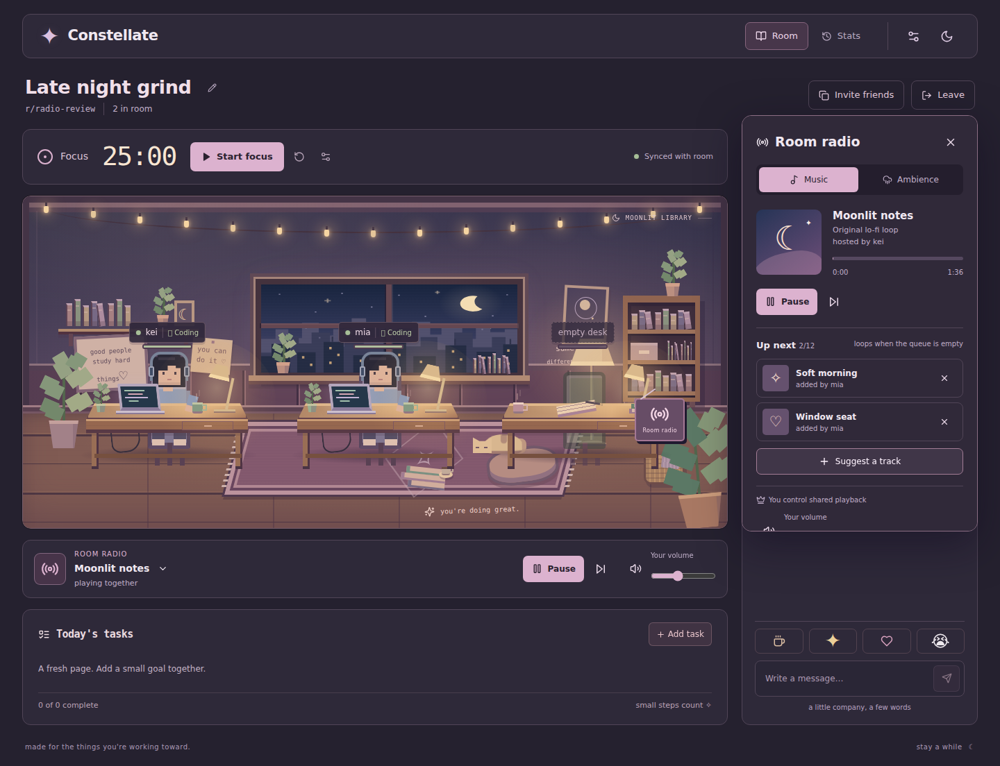
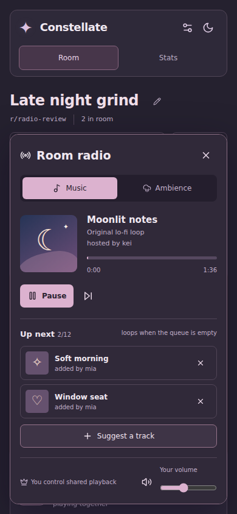

# Room radio — branch preview

A small radio in the study scene opens a music panel. The player beneath the room shows the current track, shared playback controls, and personal volume. On desktop the panel opens over the companion sidebar; on mobile it opens as a scrollable bottom sheet.

## Try it

From an existing configured checkout, fetch and switch to `feature/room-radio`, then run `npm run dev` from the repository root. This starts both the frontend and backend using the project's existing PostgreSQL and Redis settings. Open the same room in two separate browser profiles or an ordinary and private window to test two people.

1. Click the little radio in the room, or the player title beneath it.
2. The first connected member is the radio host. Click Play to start listening and share playback.
3. Other members click Listen once to enable sound on their own device.
4. Use Suggest a track to add music or ambience to the shared queue. The host can choose the current track, pause, skip, or remove a queued item.
5. Change Your volume or mute: only your device is affected.

This feature needs **both the frontend and backend from this branch**. A frontend-only preview connected to the existing production backend cannot process the new radio events. Main and the production deployment are not changed by this branch.

## Included sound library

- Moonlit notes, Soft morning, and Window seat: three original synthesized instrumental compositions.
- Rain at the window and Quiet café: synthesized ambience, including a soft murmur and light cup-like chimes for the café.

Each selection lasts 1:36, comprising a seamless 32-second loop repeated three times. The next queued selection starts when it ends; an empty queue repeats the current selection. No Spotify login, external audio recordings, API credentials, paid service, or new runtime dependency is required. These are original loops, not a catalog of commercial songs.

## Shared behavior

The existing Redis runtime owns the host, track, position, playing state, and queue. Socket.IO distributes snapshots. Browser audio follows server timestamps with a monotonic clock and corrects drift. Queue suggestions are capped at 12 and radio changes are rate limited per member across tabs.

Hosting transfers to a connected member when the host's final connection leaves or expires. Playback pauses when nobody is connected. Reconnect restores the current room state; refresh requires another Listen gesture. Radio state is ephemeral in Redis, so deleting or losing that runtime resets the radio. No database migration is needed.

## Verification

- Client and server production builds pass.
- 98 TypeScript tests and 2 React rendering tests pass, including seven new radio tests covering permissions, queue limits, clock recovery, host transfer, transport isolation, and generated audio.
- Two Chromium sessions using the production Redis runtime verify explicit audio opt-in, real audio buffers and playback, shared changes, personal volume/mute, suggestions, ambience, reconnect, automatic queue advancement, host transfer, refresh, Escape dismissal, and layout at 390px.

The browser test stubs SQL accounting because the radio adds no SQL records; it uses real Redis and production socket handlers. Run it against a local test Redis with `RADIO_TEST_REDIS_URL=redis://127.0.0.1:6379 npm run test:radio:browser --prefix server` after installing Playwright Chromium. It creates and removes only its unique test namespace.
